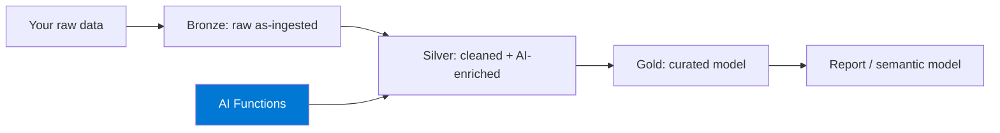
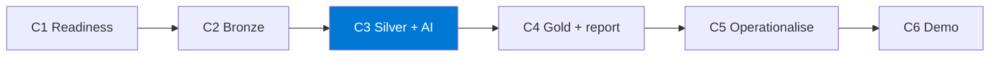

import { CardGrid, LinkCard } from "@astrojs/starlight/components";

Rakenna **medallion lakehouse** (bronze → silver → gold) **Microsoft Fabricissa** ja käytä **AI Functions** -toimintoja datasi rikastamiseen LLM-pohjaisilla muunnoksilla — kuratoi sen jälkeen gold-taulu ja raportti sen päälle.

Tämä on alustakohtaisin polku. Se vaatii **maksullisen Fabric-kapasiteetin (F2 tai suurempi)** ja tenantin, jossa **AI Functions on otettu käyttöön**. Lue Valmistelu huolellisesti — valmiusportti ratkaisee, pääsetkö rakentamaan vai jäätkö jumiin.

:::note[Yhdellä silmäyksellä]
- **Mitä luot:** Medallion-lakehousen (bronze → silver → gold) Microsoft Fabricissa, jossa silver-kerros käyttää AI Functions -rikastusta, sekä gold-raportin sen päälle.
- **Ympäristö:** Maksullinen Fabric-kapasiteetti F2 tai suurempi (RUNNING; Trial ei riitä), kapasiteettiin liitetty työtila ja tenant, jossa AI Functions on otettu käyttöön.
- **Käyttöoikeudet:** Kapasiteetin ylläpitäjän oikeudet (tai kollegan F2+-työtila); oikeus luoda Lakehouse; tenant-ylläpitäjä on ottanut AI-ominaisuudet käyttöön.

Täydellinen tarkistuslista: **[Valmistelu ja valmiustarkistus](setup/)**.
:::

## Mitä rakennat

Toimivan medallion-putken, jossa **silver-kerros** käyttää AI Functions -toimintoja (esim. luokittelu, tiivistäminen, poiminta) lisätäkseen sarakkeita, joita mikään sääntö ei pystyisi tuottamaan — mukana on **PySpark-sääntöpohjainen fallback**, jos AI Functions ei ole käytettävissä.

## Haasteketju

| Haaste | Aika | Tulos |
|-----------|------|-----------------|
| **H1 — Valmiuden varmistus** | 20 min | Ympäristövalmius ja valittu toteutuspolku |
| **H2 — Bronze-tuonti** | 30 min | Kyseltävä raakadata bronze-kerroksessa |
| **H3 — Silver + AI Functions** | 45 min | AI-rikastettu silver-kerros ja fallback-polku |
| **H4 — Gold + raportti** | 35 min | Kuratoitu gold-malli ja raporttivisuaali |
| _H5 — Operationalisointi (valinnainen)_ | 25 min | Onnistunut orkestroitu päästä päähän -ajo |
| _H6 — Demon valmistelu (valinnainen)_ | 15 min | Lyhyt demo, joka näyttää ratkaisun arvon |

:::tip[Ydin vs. valinnainen]
**H1–H4 ovat ydinpolku** — medallion lakehouse, AI-rikastettu silver-kerros ja gold-raportti muodostavat valmiin lopputuloksen. **H5–H6 ovat valinnaisia.**
:::

:::caution[Tällä polulla on ehdoton vaatimus]
Maksullinen kapasiteetti ja tenant-asetukset ovat tämän polun edellytys. H1 vain *varmistaa* valmiuden — se ei määritä kapasiteettia. Jos H1 ei mene läpi, et voi edetä.
:::

<CardGrid>
  <LinkCard title="Aloita tästä → Valmistelu ja valmiustarkistus" description="Tarkista, että F2+-kapasiteetti ja AI Functions ovat käytössä." href="setup/" />
  <LinkCard title="Sitten → H1: Valmius" description="Varmista kapasiteetti, workspace, lakehouse ja AI Functions -näkyvyys." href="challenge-1-readiness/" />
</CardGrid>
