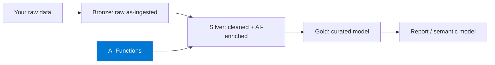
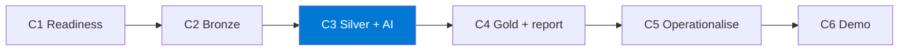

import { CardGrid, LinkCard } from "@astrojs/starlight/components";

**Stretch hackathon B.** Build a **medallion lakehouse** (bronze → silver → gold) in
**Microsoft Fabric** and use **AI Functions** to enrich your data with LLM-powered
transformations — then curate a gold table and a report on top.

This is the most platform-specific track. It needs a **paid Fabric capacity (F2 or higher)**
and a tenant where **AI Functions are enabled**. Read the Setup carefully — the readiness
gate is the difference between building and being stuck.

## What you'll build

A working medallion pipeline where the **silver layer** uses AI Functions (e.g.
classification, summarisation, extraction) to add columns no rule could — with a
**PySpark rule-based fallback** if AI Functions are unavailable.

## The challenge chain

| Challenge | Time | Output artifact |
|-----------|------|-----------------|
| **C1 — Readiness verification** | 20 min | `readiness_check.md` (all green) |
| **C2 — Bronze ingestion** | 30 min | `bronze_manifest.json` |
| **C3 — Silver + AI Functions** | 45 min | `silver_enrichment_spec.md` (+ PySpark fallback) |
| **C4 — Gold + report** | 35 min | `gold_model_spec.md` + one report |
| _C5 — Operationalise (optional)_ | 25 min | `pipeline_run_evidence.md` |
| _C6 — Demo prep (optional)_ | 15 min | `demo_story.md` + recording |

:::tip[Core vs. optional]
**C1–C4 are the core path** — a medallion lakehouse with an AI-enriched silver layer and a
gold report is a complete result. **C5–C6 are optional.**
:::

:::caution[This track has a hard prerequisite]
You **must** complete the capacity + tenant-switch pre-work before the event. C1 only
*verifies* readiness — it does not set up capacity. If C1 isn't green, you can't proceed.
:::

<CardGrid>
  <LinkCard title="Start here → Setup & pre-work" description="Provision F2+ capacity and enable AI Functions before the day." href="setup/" />
  <LinkCard title="Then → C1: Readiness" description="Verify capacity, workspace, lakehouse, and AI Functions visibility." href="challenge-1-readiness/" />
</CardGrid>
