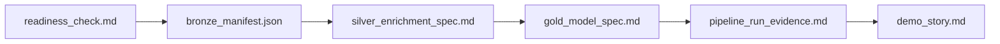

## You built an AI-enriched medallion lakehouse

From raw files to a curated report, your team built a **bronze → silver → gold** lakehouse in
Microsoft Fabric and used **AI Functions** (or a documented PySpark fallback) to add a column
no rule could — then turned it into a business insight.

## Demo format

- **3 minutes per team**, then 1 minute of questions.
- Show the hero shot: **raw text → AI-enriched column → report visual.**
- State whether you used AI Functions or the fallback — both count.

## Award categories

| Award | What it recognises |
| --- | --- |
| ✨ **Best AI enrichment** | Most valuable AI-derived column |
| 🏗️ **Cleanest medallion** | Best bronze/silver/gold separation & discipline |
| 📊 **Best insight** | Report that tells the clearest business story |
| 🔁 **Best pipeline** | Most robust, well-orchestrated end-to-end run |

## What to take home

- **Bronze stays raw** — every early "fix" is a transformation you can't undo.
- AI Functions shine when the enriched column is **impossible with rules** — pick those use cases.
- Always have a **fallback**: a paid-capacity feature dependency is a real operational risk.
- Cap AI calls during dev; know the **full-scale cost** before you schedule it.

## Keep going after the event

- Add data quality checks between layers (row counts, null thresholds).
- Promote the silver enrichment to a reusable function across datasets.
- Track AI enrichment cost per run and add alerting on spend.

Thanks for hacking. 🎉
