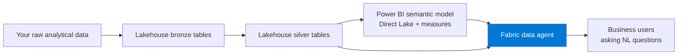
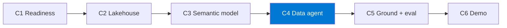

import { CardGrid, LinkCard } from "@astrojs/starlight/components";

Rakenna hallittu **Fabric data agent**, jonka avulla liiketoimintakäyttäjät voivat esittää
luonnollisen kielen kysymyksiä **lakehousen** ja **Power BI:n semanttisen mallin** tiedoista — ja todista toimivuus
pienellä arviointijoukolla ja napakalla demotarinalla.

Tämä on Fabric-poluista keskustelulähtöisin. Se vaatii **maksullisen Fabric-kapasiteetin (F2 tai
suurempi)** ja tenantin, jossa **Copilot / Fabric data agent -ominaisuudet on otettu käyttöön**. Lue Valmistelu
huolellisesti — valmiusportti ratkaisee, pääsetkö rakentamaan vai jäätkö jumiin.

:::note[Yhdellä silmäyksellä]
- **Mitä luot:** Hallitun Fabric data agentin lakehousen ja Power BI:n semanttisen mallin päälle, sekä pienen arviointijoukon sen todistamiseen.
- **Ympäristö:** Maksullinen Fabric-kapasiteetti F2 tai suurempi (RUNNING; Trial ei riitä), kapasiteettiin liitetty työtila ja tenant, jossa Copilot / data agent -ominaisuudet on otettu käyttöön.
- **Käyttöoikeudet:** Oikeus luoda Lakehouse ja semanttinen malli; Read-oikeus kaikkiin liitettäviin semanttisiin malleihin; tenant-ylläpitäjä on ottanut data agent -AI-asetukset käyttöön.

Täydellinen tarkistuslista: **[Valmistelu ja valmiustarkistus](setup/)**.
:::

## Mitä rakennat

Lakehouse-pohjainen analyyttinen malli, kuratoitu semanttinen kerros ja **Fabric data agent**, joka
vastaa ankkuroituihin luonnollisen kielen kysymyksiin käyttäen valitsemasi datan SQL:ää / DAX:ia.

## Haasteketju

Jokainen haaste rakentaa toimivan kyvykkyyden, jota seuraava haaste hyödyntää.

| Haaste | Aika | Tulos |
|-----------|------|-----------------|
| **H1 — Valmiuden varmistus** | 20 min | Valmiustarkistus |
| **H2 — Lakehouse-perusta** | 35 min | Analytiikkavalmis lakehouse |
| **H3 — Semanttinen malli** | 35 min | Semanttinen malli |
| **H4 — Fabric data agent** | 40 min | Toimiva data agent |
| _H5 — Ankkurointi + arviointi (valinnainen)_ | 25 min | Arviointijoukko |
| _H6 — Demon valmistelu (valinnainen)_ | 15 min | Demotarina |

:::tip[Ydin vs. valinnainen]
**H1–H4 ovat ydinpolku** — kun saat ne valmiiksi, sinulla on demottava keskusteleva analytiikka-agentti.
**H5–H6 ovat valinnaista viimeistelyä.** Älä aloita H5:tä ennen kuin H4 vastaa vähintään kolmeen ankkuroituun
kysymykseen.
:::

:::caution[Tällä polulla on tiukka vaatimus]
Maksullinen kapasiteetti ja tenant-asetukset ovat tämän polun edellytys. H1 vain
*varmistaa* valmiuden — se ei määritä kapasiteettia. Jos H1 ei mene läpi, et voi jatkaa.
:::

## Vinkki perusesimerkin datajoukoksi

Tuo oma ei-arkaluonteinen analyyttinen data, jos voit. Jos et, suosi suomalaista avointa dataa, kuten
**Tilastokeskusta (stat.fi)** tai **Avoindata.suomi.fi:tä**, tai käytä Fabricin sisäänrakennettua **NYC Taxi** -dataa,
jotta voit keskittyä data-agentin toimintaan datajoukon etsimisen sijaan.

<CardGrid>
  <LinkCard title="Aloita tästä → Valmistelu ja valmiustarkistus" description="Tarkista maksullinen F2+-kapasiteetti, tenant-asetukset, käyttöoikeudet ja data." href="setup/" />
  <LinkCard title="Sitten → H1: Valmius" description="Varmista kapasiteetti, työtila, lakehouse ja Fabric data agentin näkyvyys." href="challenge-1-readiness/" />
</CardGrid>