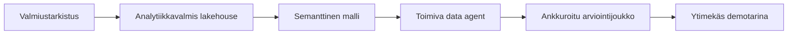

## Rakensit keskustelevaa analytiikkaa hallitun Fabric-datan päälle

Valmiudesta ja datajoukosta alkaen tiimisi muotoili lakehousen, lisäsi semanttisen kerroksen ja
pystytti **Fabric data agentin**, joka vastaa liiketoimintakysymyksiin hallittujen tietolähteiden ja
selkeiden ohjeiden avulla.

## Demon muoto

- **Lyhyt demo per tiimi**, sitten aikaa muutamalle kysymykselle.
- Aloita **wow-hetkellä**: liiketoimintakäyttäjä esittää yhden luonnollisen kielen kysymyksen ja saa ankkuroituneen vastauksen.
- Näytä luottamuksen lähde: mittari, valittu taulu, luotu SQL/DAX tai arviointitulos.
- Nimeä yksi rajoitus ja yksi seuraava vaihe. Rehellisyys tuo pisteitä.

## Palkintokategoriat

| Palkinto | Mitä se tunnistaa |
| --- | --- |
| 🗣️ **Paras keskusteleva oivallus** | Selkein luonnollisen kielen kysymyksestä vastaukseen -hetki |
| 📐 **Paras semanttinen ankkurointi** | Vahvimmat mittarit, suhteet ja liiketoimintamääritelmät |
| 🧪 **Paras arviointikuri** | Hyödyllisin kysymysjoukko ja pass/fail-näyttö |
| 🛡️ **Paras hallittu agentti** | Selkein taulurajaus, käyttöoikeustarina ja turvalliset rajoitukset |

## Mitä viet mukanasi

- **Kyvykkyysketju** on uudelleenkäytettävä: valmius → analytiikkavalmis lakehouse → semanttinen malli → toimiva data agent → arviointi → demo.
- Fabric data agent on vahvimmillaan, kun semanttinen malli sisältää viralliset mittarit ja lakehouse sisältää hyvin nimetyt taulut.
- Luonnollisen kielen analytiikka tarvitsee silti teknistä kurinalaisuutta: rajauksen, sanaston, käyttöoikeudet ja arvioinnit.

## Jatka tapahtuman jälkeen

- Lisää rivitason suojaus ja testaa, miten agentti käyttäytyy eri käyttäjillä.
- Nosta arviointi toistuvaksi regressiopaketiksi, kun taulut tai mittarit muuttuvat.
- Julkaise ja jaa data-agentti pienelle pilottiryhmälle ja kerää sitten palaute luonnosversioon.
- Tutki integraatiopolkuja, kuten Microsoft 365 Copilot, Copilot Studio tai Teams, kun hallinta on valmis.

Kiitos hackaamisesta. 🎉