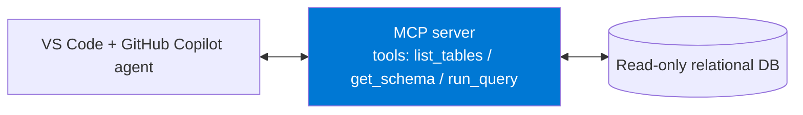
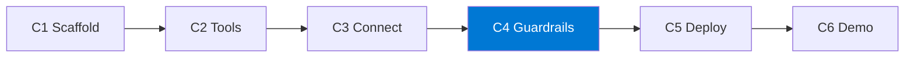

import { CardGrid, LinkCard } from "@astrojs/starlight/components";

**Polku 6.** Rakenna **Model Context Protocol (MCP) server**, joka tarjoaa datasi
turvallisina työkaluina. Yhdistä se sitten **VS Code + GitHub Copilot agent mode** -tilaan, jotta agentti voi
vastata oikeisiin kysymyksiin kutsumalla serveriäsi.

Tämä polku on kaikista eniten **agenttipohjaista kehitystä**: osallistujat rakentavat työkalun,
jota heidän koodausagenttinsa sitten käyttää. Se toimii **missä tahansa Azure-tilauksessa** — tai täysin paikallisesti —
kun käytössä on relaatiotietokanta ja paikallinen/kontitettu MCP server. Maksullista Fabricia tai
Azure OpenAI -kiintiötä ei tarvita.

:::note[Toimii missä tahansa]
Käytä Azure Database for PostgreSQLia, Azure SQL:ää, paikallista PostgreSQLia tai SQLiteä. Tärkeintä
on sopimus: **vain luku -datakäyttö MCP-työkalujen kautta**.
:::

:::note[Yhdellä silmäyksellä]
- **Mitä luot:** Model Context Protocol (MCP) -serverin, joka tarjoaa datasi vain luku -työkaluina GitHub Copilotin agent mode -tilalle.
- **Ympäristö:** Node.js 20+ tai Python 3.11+; VS Code + GitHub Copilot agent mode; saavutettava relaatiotietokanta. Ei Fabricia eikä Azure OpenAI -kiintiötä.
- **Käyttöoikeudet:** MCP sallittu organisaatiosi Copilot-käytännössä; vain luku -tietokantakäyttäjä tai -identiteetti.

Täydellinen tarkistuslista: **[Valmistelu ja valmiustarkistus](setup/)**.
:::

## Mitä rakennat

MCP server, joka tarjoaa tietokannan metatiedot ja rajatut `SELECT`-kyselyt työkaluina, sekä
toimiva Copilot-määritys, joka todistaa, että agentti osaa löytää ja kutsua niitä.

## Haasteketju

Jokainen haaste rakentaa toimivan kyvykkyyden, jonka päälle seuraava jatkaa.

| Haaste | Aika | Tulos |
|-----------|------|-------|
| **H1 — Runko** | 30 min | Profiloitu tietolähde ja käynnistyvä MCP server -runko |
| **H2 — Työkalut** | 40 min | Toimivat vain luku -MCP-työkalut |
| **H3 — Yhdistä** | 30 min | Copilot käyttää MCP-työkaluja Agent-tilassa |
| **H4 — Turvarajat** | 40 min | Kovennettu vain luku -suorituspolku |
| _H5 — Käyttöönotto (valinnainen)_ | 25 min | Operoitava HTTP- tai konttikäyttöönotto |
| _H6 — Demon valmistelu (valinnainen)_ | 15 min | Harjoiteltu ja näyttöön perustuva demopolku |

:::tip[Ydin vs. valinnainen]
**H1–H4 ovat ydinpolku.** Kun saat ne valmiiksi, sinulla on turvallinen ja demottava agentti–työkalu-silmukka.
**H5–H6 ovat valinnaista viimeistelyä.** Älä tee käyttöönottoa ennen kuin paikalliset turvarajat läpäisevät testit.
:::

## Miksi MCP tässä

MCP on standardi asiakas–palvelinprotokolla, jolla AI-sovelluksille annetaan kontekstia
**työkalujen**, **resurssien** ja **kehotteiden** kautta. Tässä polussa keskityt ensin työkaluihin: agentti
voi listata tauluja, tarkastaa skeeman ja ajaa turvallisia vain luku -kyselyitä upottamatta
salaisuuksia tai tietokannan kirjoitusoikeuksia kehotteeseensa.

<CardGrid>
  <LinkCard title="Aloita tästä → Valmistelu ja valmiustarkistus" description="Kehitysympäristö, tietokantakäyttö, vain luku -käyttäjä ja varadatasetit." href="setup/" />
  <LinkCard title="Sitten → H1: Runko" description="Profiloi tietolähteesi ja luo ensimmäinen MCP server -runko." href="challenge-1-scaffold/" />
</CardGrid>

