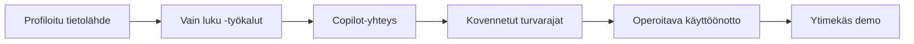

## Rakensit agenttiturvallisen datarajapinnan

Relaatiotietokannasta alkaen tiimisi profiloi lähteen, rakensi MCP serverin,
yhdisti sen GitHub Copilotiin ja kovensi sen niin, että agentin ohjaama käyttö on vain luku,
rajattua ja identiteettitietoista.

## Demon muoto

- **Lyhyt demo per tiimi**, sitten aikaa muutamalle kysymykselle.
- Aloita **wow-hetkestä**: Copilot vastaa oikeaan kysymykseen kutsumalla työkalujasi.
- Näytä **turvallisuushetki**: haitallinen kirjoitus-/`DROP`-pyyntö hylätään.
- Nimeä yksi rajoite ja yksi seuraava vaihe. Rehellisyydestä saa pisteitä.

## Palkintokategoriat

| Palkinto | Mitä se tunnistaa |
| --- | --- |
| 🧰 **Paras MCP-työkalumäärittely** | Siistein työkaluskeema, tulosmuodot ja agentin käytettävyys |
| 🛡️ **Vahvimmat turvarajat** | Paras vain luku -, rajattu ja vähimmän oikeuden periaatteen mukainen pakotus |
| 🕵️ **Paras perusteltu vastaus** | Vakuuttavin työkaluihin perustuva dataoivallus |
| 🚀 **Paras operointipolku** | Paras kontti-, HTTP-, Managed Identity- ja lokitustarina |

## Mitä viet mukanasi

- MCP muuttaa agentti-integraation **sopimukseksi**: työkalut, resurssit, kehotteet, siirtotavat.
- Tärkein tietokantatyökalu ei ole `run_query`; se on **sen ympärillä oleva turvaraja**.
- Agenttipohjainen kehitys toimii parhaiten, kun agentti auttaa rakentamaan työkaluja, joita se voi käyttää heti.
- Managed Identity ja vain luku -tietokantaroolit eivät ole viimeistelyä — ne ovat perusta.

## Jatka tapahtuman jälkeen

- Lisää MCP **resursseja** skeemadokumenteille tai liiketoimintasanaston kontekstille.
- Lisää arviointijoukko luonnollisen kielen kysymyksistä ja odotetuista SQL-/tulosmalleista.
- Vie HTTP-käyttöönotto oikean todennuksen ja yksityisen verkotuksen taakse.
- Lisää auditointilokit jokaiselle työkalukutsulle: käyttäjän kehote, SQL, rivimäärä, kesto, kieltäytymisen syy.

Kiitos hackathonista. 🎉
