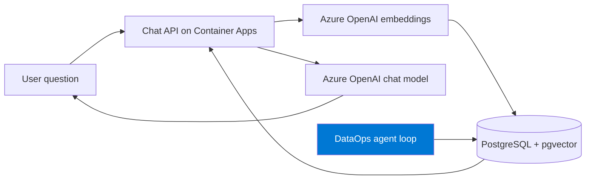
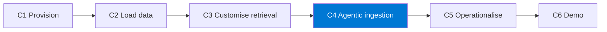

import { CardGrid, LinkCard } from "@astrojs/starlight/components";

**Suositeltu aloituspolku.** Pystytä toimiva **retrieval-augmented generation (RAG)** -chat-sovellus Azureen yhdellä `azd up` -komennolla, liitä siihen **oma datasi** ja käytä agenttia sen **laajentamiseen ja tuotantokuntoon viemiseen** pienenä DataOps-putkena.

Tämä polku on kolmesta vaihtoehdosta itsenäisin ja toimii **missä tahansa Azure-tilauksessa** (tarvitset vain Azure OpenAI -kiintiön — katso Valmistelu).

:::note[Yhdellä silmäyksellä]
- **Mitä luot:** Hakua hyödyntävän RAG-chat-sovelluksen (Container Apps + PostgreSQL/pgvector + Azure OpenAI) ja agenttisen DataOps-ingestiosilmukan.
- **Ympäristö:** Mikä tahansa Azure-tilaus; Azure OpenAI -kiintiö (chat- ja upotusmalli); `azd`, Docker ja IDE, jossa GitHub Copilot.
- **Käyttöoikeudet:** Oikeus luoda resursseja tilaukseen (`azd provision`, ~Contributor) sekä käyttää Azure OpenAI -palvelua.

Täydellinen tarkistuslista: **[Valmistelu ja valmiustarkistus](setup/)**.
:::

## Mitä rakennat

Chat-sovellus, joka vastaa kysymyksiin dokumentteihisi perustuen, sekä pieni **agenttinen ingestiosilmukka**, joka pitää tietopohjan ajan tasalla.

## Haasteketju

Jokainen haaste rakentaa toimivaa kyvykkyyttä, jota seuraava haaste hyödyntää.

| Haaste | Aika | Tulos |
|-----------|------|-----------------|
| **H1 — Resurssien käyttöönotto** | 25 min | Saavutettava RAG-sovellus ja tunnistetut resurssit |
| **H2 — Lataa oma data** | 35 min | Oma data haettavissa ja regressio suojattu |
| **H3 — Mukauta hakua** | 40 min | Tarkempi ja turvallisempi hakukokemus |
| **H4 — Agenttinen ingestiosilmukka** | 40 min | Itseään testaava ingestiosilmukka |
| _H5 — Vie tuotantokuntoon (valinnainen)_ | 25 min | Ajastettu ja todennettu CI-ajo |
| _H6 — Demon valmistelu (valinnainen)_ | 15 min | Lyhyt ja sujuva tiimidemo |

:::tip[Ydin vs. valinnainen]
**H1–H4 ovat ydinpolku** — kun saat ne valmiiksi, sinulla on demoamiskelpoinen tulos. **H5–H6 ovat valinnaista viimeistelyä.** Älä aloita H5:tä ennen kuin H4 läpäisee testit.
:::

## Perussovellus

Tämä polku perustuu hyvin testattuun [`Azure-Samples/rag-postgres-openai-python`](https://github.com/Azure-Samples/rag-postgres-openai-python) -kiihdyttimeen (FastAPI + React, PostgreSQL Flexible Server + `pgvector`, Azure OpenAI Azure Container Apps -ympäristössä).

<CardGrid>
  <LinkCard title="Aloita tästä → Valmistelu ja valmiustarkistus" description="Tarkista, että ympäristö ja Azure OpenAI -kiintiö ovat kunnossa." href="setup/" />
  <LinkCard title="Sitten → H1: Resurssien käyttöönotto" description="Aja azd up ja tutki infrastruktuuria Copilotin kanssa." href="challenge-1-provision/" />
</CardGrid>
