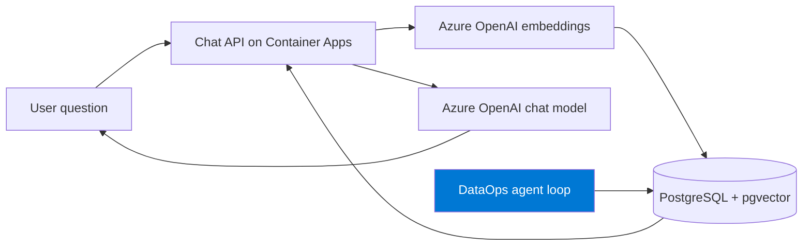
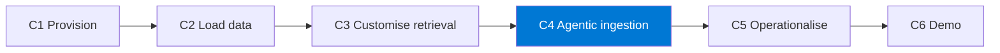

import { CardGrid, LinkCard } from "@astrojs/starlight/components";

**Primary hackathon.** Stand up a working **retrieval-augmented generation (RAG)** chat
app on Azure with a single `azd up`, point it at **your own data**, then use an agent to
**extend it and operationalise it** as a small DataOps pipeline.

This track is the most self-contained of the three and runs in **any Azure subscription**
(you only need Azure OpenAI quota — see Setup).

## What you'll build

A chat app that answers questions grounded in your documents, plus a small **agentic
ingestion loop** that keeps the knowledge base fresh.

## The challenge chain

Each challenge emits a named artifact consumed by the next.

| Challenge | Time | Output artifact |
|-----------|------|-----------------|
| **C1 — Provision** | 25 min | `infra-output.json` (live endpoint) |
| **C2 — Load your data** | 35 min | `dataset_manifest.json` + passing smoke test |
| **C3 — Customise retrieval** | 40 min | `retrieval_config.md` + updated app |
| **C4 — Agentic ingestion loop** | 40 min | `dataops_agent.py` + regression pass |
| _C5 — Operationalise (optional)_ | 25 min | `dataops.yml` + run evidence |
| _C6 — Demo prep (optional)_ | 15 min | `demo_script.md` + recording |

:::tip[Core vs. optional]
**C1–C4 are the core path** — finish those and you have a demoable result. **C5–C6 are
optional polish.** Don't start C5 until C4 passes.
:::

## Base app

This track builds on the well-tested
[`Azure-Samples/rag-postgres-openai-python`](https://github.com/Azure-Samples/rag-postgres-openai-python)
accelerator (FastAPI + React, PostgreSQL Flexible Server + `pgvector`, Azure OpenAI, on
Azure Container Apps).

<CardGrid>
  <LinkCard title="Start here → Setup & pre-work" description="Complete the readiness checklist 7 days before the event." href="setup/" />
  <LinkCard title="Then → C1: Provision" description="azd up and explore the infrastructure with Copilot." href="challenge-1-provision/" />
</CardGrid>
