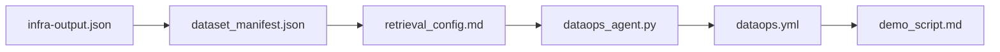

## You built a self-refreshing knowledge base

Starting from an idea and a base app, your team provisioned infrastructure, loaded its own
data, tuned retrieval, and — the payoff — stood up an **agentic ingestion loop** that keeps
the knowledge base fresh and proves it didn't break anything.

## Demo format

- **3 minutes per team**, then 1 minute of questions.
- Lead with your **wow moment** (ideally the C4 ingest-then-answer arc).
- Name one limitation and one next step. Honesty scores.

## Award categories

| Award | What it recognises |
| --- | --- |
| 🌐 **Most domains ingested** | Breadth of sources the agent handled |
| 🧪 **Best test coverage** | Strongest regression / smoke-test discipline |
| 💡 **Most creative prompt** | Cleverest retrieval / prompt engineering |
| 🔁 **Best DataOps loop** | Cleanest, most idempotent operational pipeline |

## What to take home

- The **artifact chain** is a reusable DataOps pattern: manifest → config → agent → CI → demo.
- Agentic coding shines when you **own the contract** (inputs, outputs, assertions) and let
  the agent write the glue.
- An ingestion loop without a **regression check** is a liability, not a feature.

## Keep going after the event

- Add more source types (PDF tables, HTML, transcripts) to `dataops_agent.py`.
- Promote the smoke test into a small **eval set** with scored answers.
- Move secrets to a managed identity + Key Vault instead of Actions secrets.

Thanks for hacking. 🎉
