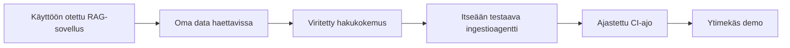

## Rakensit itse päivittyvän tietopohjan

Ideasta ja perussovelluksesta lähtien tiimisi otti käyttöön infrastruktuurin, latasi oman datansa, viritti haun ja — palkintona — pystytti **agenttisen ingestiosilmukan**, joka pitää tietopohjan ajan tasalla ja todistaa, ettei se rikkonut mitään.

## Demon muoto

- **Lyhyt demo per tiimi**, sitten aikaa muutamalle kysymykselle.
- Aloita **wow-hetkelläsi** (mieluiten H4:n ingestoi-sitten-vastaa-kaari).
- Nimeä yksi rajoite ja yksi seuraava vaihe. Rehellisyys tuo pisteitä.

## Palkintokategoriat

| Palkinto | Mitä se tunnistaa |
| --- | --- |
| 🌐 **Eniten ingestoituja toimialoja** | Lähteiden laajuus, jonka agentti käsitteli |
| 🧪 **Paras testikattavuus** | Vahvin regressio- / smoke-testikuri |
| 💡 **Luovin kehote** | Nokkelin haku- / kehotesuunnittelu |
| 🔁 **Paras DataOps-silmukka** | Siistein ja idempotentein operointiputki |

## Mitä viet kotiin

- **Kyvykkyysketju** on uudelleenkäytettävä DataOps-malli: käyttöönotto → oma data → viritetty haku → agentti → CI → demo.
- Agenttinen koodaus loistaa, kun **omistat sopimuksen** (syötteet, tulokset, tarkistukset) ja annat agentin kirjoittaa liimakoodin.
- Ingestiosilmukka ilman **regressiotarkistusta** on riski, ei ominaisuus.

## Jatka tapahtuman jälkeen

- Lisää `dataops_agent.py`-tiedostoon lisää lähdetyyppejä (PDF-taulukot, HTML, transkriptit).
- Nosta smoke-testi pieneksi **arviointijoukoksi**, jossa vastaukset pisteytetään.
- Siirrä salaisuudet Managed Identity + Key Vault -ratkaisuun Actions secrets -salaisuuksien sijaan.

Kiitos hackathonista. 🎉
