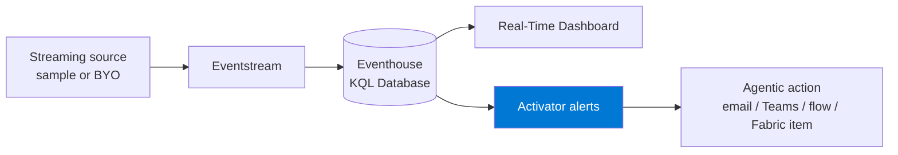
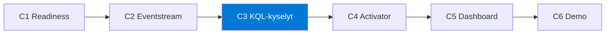

import { CardGrid, LinkCard } from "@astrojs/starlight/components";

**Polku 5.** Rakenna **suoratoistava reaaliaikainen analytiikkaratkaisu** Microsoft Fabricissa: tuo
live-tapahtumat **Eventstreamillä**, tallenna ja kysele niitä **Eventhouse / KQL Database** -kohteessa ja
laita data sitten **valvomaan itseään ja toimimaan** Fabric **Activatorilla**.

Tämä on alustakohtainen polku. Se tarvitsee **maksullisen Fabric-kapasiteetin (F2 tai suurempi)**,
kapasiteettiin liitetyn työtilan ja tenantin, jossa **Real-Time Intelligence** -kohteet ovat
käytettävissä. Lue Valmistelu huolellisesti — H1 varmistaa valmiuden, se ei luo kapasiteettia.

:::note[Yhdellä silmäyksellä]
- **Mitä luot:** Reaaliaikaisen suoratoistoratkaisun: Eventstream → Eventhouse/KQL → Activator-hälytys, sekä valinnaisen Real-Time Dashboard -koontinäytön.
- **Ympäristö:** Maksullinen Fabric-kapasiteetti F2 tai suurempi (RUNNING), kapasiteettiin liitetty työtila ja tenant, jossa Real-Time Intelligence on käytössä.
- **Käyttöoikeudet:** Contributor-oikeudet tai korkeammat työtilassa; oikeus luoda Eventstream, Eventhouse ja KQL Database; sallittu toimintokohde (sähköposti, Teams, Power Automate tai Fabric-kohde).

Täydellinen tarkistuslista: **[Valmistelu ja valmiustarkistus](setup/)**.
:::

## Mitä rakennat

Live-tapahtumaputki, jossa käyttäjät voivat kysellä, mitä tapahtuu **juuri nyt**, nähdä sen
automaattisesti päivittyvällä koontinäytöllä (dashboard) ja käynnistää toimenpiteen, kun ehto täyttyy.

## Haasteketju

Jokainen haaste rakentaa kyvykkyyden, jota seuraava haaste hyödyntää.

| Haaste | Aika | Tulos |
|-----------|------|-----------------|
| **H1 — Valmiuden tarkistus** | 20 min | Valmiustarkistus |
| **H2 — Eventstreamistä Eventhouseen** | 35 min | Live-suoratoisto |
| **H3 — KQL-kyselyt** | 40 min | Toimivat KQL-kyselyt |
| **H4 — Activator-hälytys** | 35 min | Activator-hälytys |
| _H5 — Real-Time Dashboard -koontinäyttö (valinnainen)_ | 25 min | Reaaliaikainen koontinäyttö |
| _H6 — Demon valmistelu (valinnainen)_ | 15 min | Demotarina |

:::tip[Ydin vs. valinnainen]
**H1–H4 ovat ydinpolku** — live-suoratoisto, toimivat KQL-kyselyt ja Activator-sääntö muodostavat
valmiin demon. **H5–H6 ovat valinnaista viimeistelyä.** Älä aloita H5:tä ennen kuin H4 on valmis.
:::

:::caution[Tällä polulla on ehdoton vaatimus]
Maksullinen kapasiteetti on tämän polun edellytys. Ohjeissa voidaan mainita Trial
joissakin Eventstream-virroissa, mutta tämä polku vakioidaan **maksulliseen F2+-kapasiteettiin**, jotta Real-Time
Intelligence, Eventhouse, koontinäyttö (dashboard) ja Activator-ominaisuudet ovat tiimin käytettävissä.
:::

<CardGrid>
  <LinkCard title="Aloita tästä → Valmistelu ja valmiustarkistus" description="Varmista maksullinen F2+-kapasiteetti, Real-Time Intelligence -saatavuus ja turvallinen tapahtumalähde." href="setup/" />
  <LinkCard title="Sitten → H1: Valmius" description="Varmista kapasiteetti, työtila, Eventhouse, Eventstream ja RTI-kohteiden näkyvyys." href="challenge-1-readiness/" />
</CardGrid>
