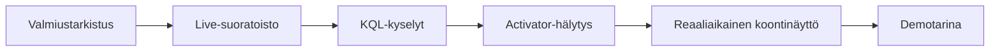

## Rakensit itse toimivan reaaliaikaisen järjestelmän

Live- tai toistetusta lähteestä tiimisi rakensi Fabric Real-Time Intelligence -polun:
Eventstream-ingestion, Eventhouse/KQL-analytiikan, Activator-hälytykset ja valinnaisesti
Real-Time Dashboardin yhteistä tilannekuvaa varten.

## Demon muoto

- **Lyhyt demo per tiimi**, sitten aikaa muutamalle kysymykselle.
- Aloita **vau-hetkellä**: live-tapahtuma laukaisee Activator-hälytyksen tai -toiminnon.
- Näytä yksi KQL-kysely, joka selittää signaalin.
- Nimeä yksi rajoite ja yksi seuraava vaihe. Rehellisyydestä saa pisteitä.

## Palkintokategoriat

| Palkinto | Mitä se tunnistaa |
| --- | --- |
| ⚡ **Nopein signaalista toimintaan** | Selkein polku tapahtumasta hälytykseen/toimintoon |
| 📈 **Paras KQL-oivallus** | KQL-kyselyt, jotka selittävät suoratoiston luottamusta herättävästi |
| 🚨 **Hyödyllisin Activator-sääntö** | Hälytys, joka on toiminnallinen eikä meluisa |
| 🎛️ **Paras live-operoinnin tarina** | Koontinäyttö/demo, joka tekee reaaliaikaisesta arvosta ilmeisen |

## Mitä viet mukanasi

- **Kyvykkyysketju** on uudelleenkäytettävä reaaliaikainen malli: valmius → live-suoratoisto → KQL-kyselyt → Activator-hälytys → koontinäyttö → tarina.
- KQL loistaa, kun tunnet **raekoon**: aikaleima, objektitunniste, metriikka ja ulottuvuudet.
- Activator on tehokkaimmillaan, kun hälytys sisältää **kontekstin ja toiminnon**, ei vain kynnystä.
- Reaaliaikaiset demot tarvitsevat **toisto- tai kynnysvarasuunnitelman**. Ajoitus on osa järjestelmää.

## Jatka tapahtuman jälkeen

- Korvaa esimerkkidata tuotannon Event Hubs-, IoT Hub-, Kafka- tai CDC-lähteellä.
- Lisää tapahtumien käsittely ennen ingestionia suodatusta, muotoilua tai aggregointia varten.
- Laukaise Fabric-pipeline/notebook rikastamaan tapahtumia tai avaamaan operatiivinen työnkulku.
- Seuraa kustannuksia ja kapasiteettikuormaa ennen tapahtumatahdin tai koontinäytön päivityksen kasvattamista.

Kiitos hackathonista. 🎉
