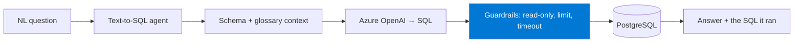
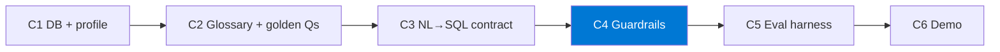

import { CardGrid, LinkCard } from "@astrojs/starlight/components";

Rakenna agentti, joka muuttaa **luonnollisen kielen kysymykset** **turvalliseksi,
oikeaksi SQL:ksi** **omassa relaatiotietokannassasi** — ja todista sen toimivuus arviointikehyksellä
pelkän tuntuman sijaan.

Tämä polku käyttää **PostgreSQL**-tietokantaa (paikallisesti tai Azuressa) ja **Azure OpenAI** -palvelua. Vaikea ja arvokas
osa ei ole SQL:n tuottaminen — vaan sen tekeminen **turvalliseksi** (vain luku, rajattu) ja **mitattavasti
oikeaksi**.

:::note[Yhdellä silmäyksellä]
- **Mitä luot:** Text-to-SQL-agentin, joka muuntaa luonnollisen kielen kysymykset turvalliseksi SQL:ksi, sekä arviointikehyksen sen oikeellisuuden todistamiseen.
- **Ympäristö:** PostgreSQL (paikallinen tai Azure); Azure OpenAI -kiintiö (gpt-4o / gpt-4.1); Python ja GitHub Copilot.
- **Käyttöoikeudet:** Oikeus luoda vain luku -tietokantakäyttäjä sekä käyttää Azure OpenAI -palvelua.

Täydellinen tarkistuslista: **[Valmistelu ja valmiustarkistus](setup/)**.
:::

## Mitä rakennat

Agentti, joka vastaa liiketoimintakysymyksiin luonnollisella kielellä, **näyttää suorittamansa SQL:n** ja
**kieltäytyy vaarallisista kyselyistä** — validoituna kultaisten kysymysten joukolla.

## Haasteketju

| Haaste | Aika | Tulos |
|-----------|------|-----------------|
| **H1 — Tietokanta ja skeemaprofiili** | 35 min | Tarkistettu skeemakäsitys + vain luku -tietokantakäyttäjä |
| **H2 — Liiketoimintasanasto ja kultaiset kysymykset** | 30 min | Liiketoimintasanasto + 5 kultaista kysymystä |
| **H3 — NL→SQL-kehotesopimus** | 40 min | Toistettava NL→SQL-silmukka + toimiva agentti |
| **H4 — Turvarajat** | 35 min | Vain luku -suoritus, rajaus ja aikakatkaisu |
| _H5 — Arviointikehys (valinnainen)_ | 30 min | Toistettava arviointi + läpäisyaste |
| _H6 — Demon valmistelu (valinnainen)_ | 15 min | Harjoiteltu demo + tallenne |

:::tip[Ydin vs. valinnainen]
**H1–H4 ovat ydinpolku.** Turvallinen agentti, joka vastaa kultaisiin kysymyksiisi, on valmis
tulos. **H5–H6 ovat valinnaisia.** Älä aloita H5:tä ennen kuin H4 läpäisee.
:::

## Miksi turvarajat ovat keskeisiä

LLM, joka voi tuottaa `DROP TABLE`-komennon tietokantaasi vastaan, on riski. Tässä polussa
**vain luku -valvonta ja kyselyjen rajaaminen ovat arvioitava kyvykkyys**, eivät sivuseikka —
luot vain luku -käyttäjän **valmistelussa** ja kovennat kerroksen **H4:ssä**.

<CardGrid>
  <LinkCard title="Aloita tästä → Valmistelu ja valmiustarkistus" description="Relaatiodatan säännöt, vain luku -käyttäjä ja OpenAI-kiintiö." href="setup/" />
  <LinkCard title="Sitten → H1: Tietokanta ja profiili" description="Lataa data ja luo koneellisesti luettava skeemaprofiili." href="challenge-1-database/" />
</CardGrid>
