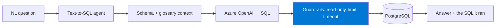
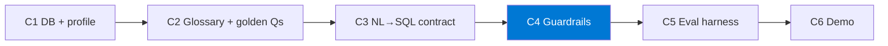

import { CardGrid, LinkCard } from "@astrojs/starlight/components";

**Stretch hackathon A.** Build an agent that turns **plain-English questions** into **safe,
correct SQL** over **your own relational database** — then prove it works with an evaluation
harness instead of vibes.

This track runs on **PostgreSQL** (local or Azure) and **Azure OpenAI**. The hard, valuable
part isn't generating SQL — it's making it **safe** (read-only, bounded) and **measurably
correct**.

## What you'll build

An agent that answers business questions in natural language, **shows the SQL it ran**, and
**refuses unsafe queries** — validated against a set of golden questions.

## The challenge chain

| Challenge | Time | Output artifact |
|-----------|------|-----------------|
| **C1 — Database & schema profile** | 35 min | `schema_profile.json` + read-only DB user |
| **C2 — Business glossary & golden questions** | 30 min | `business_glossary.md` + 5 golden questions |
| **C3 — NL→SQL prompt contract** | 40 min | `prompt_contract.md` + working agent |
| **C4 — Guardrails** | 35 min | `sql_guardrails.py` (read-only, bounded) |
| _C5 — Eval harness (optional)_ | 30 min | `eval_cases.json` + pass rate |
| _C6 — Demo prep (optional)_ | 15 min | `demo_questions.md` + recording |

:::tip[Core vs. optional]
**C1–C4 are the core path.** A safe agent that answers your golden questions is a complete
result. **C5–C6 are optional.** Don't start C5 until C4 passes.
:::

## Why guardrails first-class

An LLM that can emit `DROP TABLE` against your database is a liability. In this track,
**read-only enforcement and query bounding are a graded deliverable**, not an afterthought —
you create a read-only user in **pre-work**, and harden the layer in **C4**.

<CardGrid>
  <LinkCard title="Start here → Setup & pre-work" description="Relational data rules, read-only user, and OpenAI quota." href="setup/" />
  <LinkCard title="Then → C1: Database & profile" description="Load data and generate a machine-readable schema profile." href="challenge-1-database/" />
</CardGrid>
