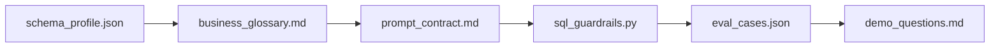

## You built a safe, measurable Text-to-SQL agent

From a database and five questions, your team built an agent that turns plain English into
**grounded, read-only, bounded** SQL — and proved its accuracy with an eval harness instead
of vibes.

## Demo format

- **3 minutes per team**, then 1 minute of questions.
- Show **one hard question answered** (with the SQL) and **one unsafe query refused**.
- If you ran the eval, state your **pass rate** up front.

## Award categories

| Award | What it recognises |
| --- | --- |
| 🎯 **Highest accuracy** | Best golden-question pass rate |
| 🛡️ **Toughest guardrails** | Most thorough safety against adversarial input |
| 🧠 **Best domain modelling** | Clearest, most useful business glossary |
| 🔬 **Best eval discipline** | Most rigorous, fair evaluation harness |

## What to take home

- **Read-only at the database** is the strongest guardrail — defence in depth on top.
- **Grade on result sets**, not SQL strings; many queries are equally correct.
- A glossary that pins **metric definitions and enums** is what makes NL→SQL trustworthy.
- An eval harness turns prompt-tweaking from guesswork into a measured loop.

## Keep going after the event

- Add row-level result explanations ("here's *why* these rows").
- Expand the golden set and track accuracy over time in CI.
- Add a `sqlglot`-based parser to enforce table allow-lists, not just SELECT-only.

Thanks for hacking. 🎉
