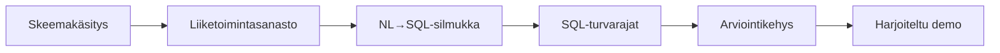

## Rakensit turvallisen ja mitattavan Text-to-SQL-agentin

Tietokannasta ja viidestä kysymyksestä tiimisi rakensi agentin, joka muuttaa luonnollisen kielen kysymykset
**ankkuroiduksi, vain luku -tilassa ajettavaksi ja rajatuksi** SQL:ksi — ja todisti tarkkuutensa arviointikehyksellä
pelkän tuntuman sijaan.

## Demon muoto

- **Lyhyt demo per tiimi**, sitten aikaa muutamalle kysymykselle.
- Näytä **yksi vaikea kysymys vastattuna** (SQL:n kanssa) ja **yksi vaarallinen kysely torjuttuna**.
- Jos ajoit arvioinnin, kerro **läpäisyaste** heti alussa.

## Palkintokategoriat

| Palkinto | Mitä se tunnistaa |
| --- | --- |
| 🎯 **Korkein tarkkuus** | Paras kultaisten kysymysten läpäisyaste |
| 🛡️ **Vahvimmat turvarajat** | Perusteellisin turvallisuus hyökkäävää syötettä vastaan |
| 🧠 **Paras toimialamallinnus** | Selkein ja hyödyllisin liiketoimintasanasto |
| 🔬 **Paras arviointikuri** | Tiukin ja reiluin arviointikehys |

## Mitä viet mukanasi

- **Vain luku tietokannassa** on vahvin turvaraja — syvyyssuuntainen puolustus sen päälle.
- **Arvioi tulosjoukkoja**, älä SQL-merkkijonoja; moni kysely voi olla yhtä oikein.
- Sanasto, joka lukitsee **mittarimääritelmät ja enumit**, tekee NL→SQL:stä luotettavaa.
- Arviointikehys muuttaa kehotteen säätämisen arvailusta mitatuksi silmukaksi.

## Jatka tapahtuman jälkeen

- Lisää rivitason tulosselitykset ("tästä syystä *nämä* rivit").
- Laajenna kultaista joukkoa ja seuraa tarkkuutta ajan myötä CI:ssä.
- Lisää `sqlglot`-pohjainen jäsennin pakottamaan taulujen sallittujen listat, ei pelkkää SELECT-only-sääntöä.

Kiitos osallistumisesta. 🎉
